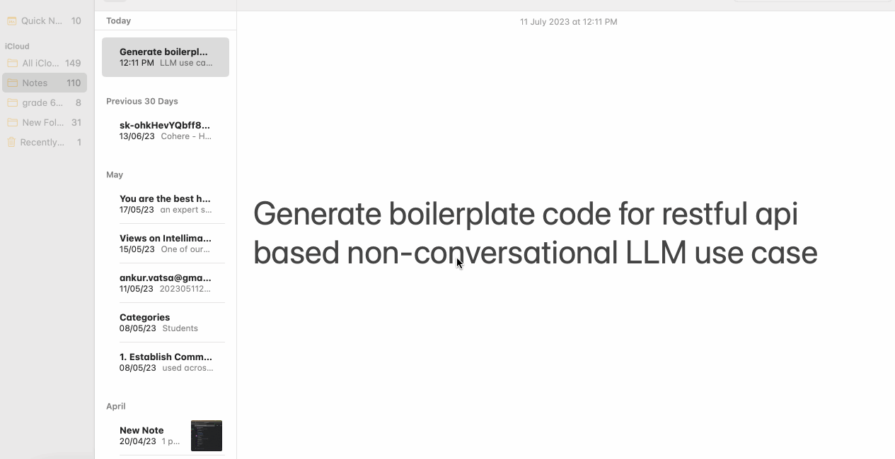

## Usage
To create a project called "My Awesome LLM Project", install [cookiecutter](https://github.com/cookiecutter/cookiecutter) and run the follwing commands:

    $ PYVER=`python3 --version|cut -d " " -f2|sed -e 's/\.//g'`
    $ CURSHL=`ps -p $$|tail -1|cut -d"-" -f2| tr '[a-z]' '[A-Z]'`
    $ if [ $PYVER -ge 3113 ] && [ "$CURSHL" = "BASH" ] || [ "$CURSHL" = "ZSH" ]; then
        pip install "cookiecutter>=1.7.0"; alias bpg='cookiecutter'; 
        if test -f ~/.profile; then
            echo "alias bpg=cookiecutter" >~/.profile 
        elif test -f ~/.zprofile; then
            echo "alias bpg=cookiecutter" >~/.zprofile
        elif test -f ~/.bashrc; then
            echo "alias bpg=cookiecutter" >~/.bashrc
        fi
    else
        echo "Error: Please ensure you have Python 3.11.3 and BASH or ZSH installed!"
    fi

Now run:

    $ bpg https://gitlab.com/vatsaaa/llm_prj_generator

You'll be prompted for some values. Provide them, and a project will be created for you.

**Warning**: After this point, change author, project, version, description, license, etc to your own information.

Answer the prompts with your own desired options. For example:

    project_name [My Awesome Project]: My Awesome LLM Project
    project_slug [reddit_clone]: myllmprj
    description [Behold My Awesome Project!]: This is my first awesome llm project
    author_name [Ankur Vatsa]: Ankur Vatsa
    domain_name [example.com]: aknurvatsa.com
    email [ankur.vatsa@gmail.com]: ankur.vatsa@gmail.com
    version [0.1.0]: 0.0.1
    Select open_source_license:
    1 - MIT
    2 - BSD
    3 - GPLv3
    4 - Apache Software License 2.0
    5 - Not open source
    Choose from 1, 2, 3, 4, 5 [1]: 1
    use_docker [n]: n

Enter the project folder and take a look around, your desired project structure and boilerplate code has been generated. Execute the following commands:

    $ cd myllmprj/
    $ source ./.venv/bin/activate
    (.venv) $ pip3 install -r requirements.txt

Start a restful api with the following command:
    (.venv) $ python3 app.py -p 8989

Once the generated code is successfully tested, create your project's git repo and push the project to it:

    $ git init
    $ git add .
    $ git commit -m "first awesome commit"
    $ git remote add origin git@github.com:vatsaaa/myllmprj.git
    $ git push -u origin master

Now take a look at your repo. Don't forget to carefully look at the generated README. Awesome, right?

### Quirks
When changing the project generator itself, remove ~/.cookiecutters/llm_prj_generator
    $ cd ~/.cookiecutters
    $ rm -rf llm_prj_generator
